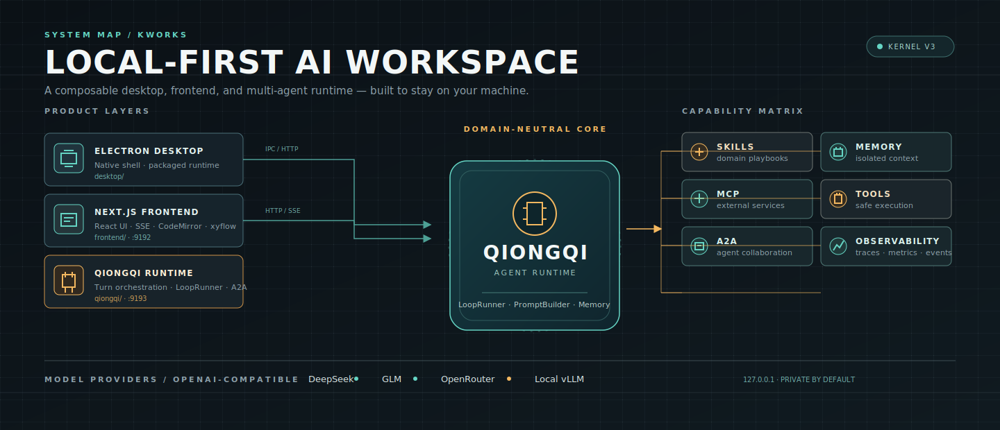

<p align="center">
  <picture>
    <source media="(prefers-color-scheme: dark)" srcset="assets/cover.svg">
    
  </picture>
</p>


# KWorks

KWorks is a local-first AI workspace built from three main parts:

- `frontend/` - Next.js web UI.
- `qiongqi/` - QiongQi TypeScript runtime and API gateway.
- `desktop/` - Electron desktop shell.

The canonical QiongQi source lives at the repository root in `qiongqi/`.
Older `third_party/qiongqi` paths are migration leftovers and should not be
used for new code.

## Quick Start

Install dependencies in the workspaces you need:

```bash
cd qiongqi && pnpm install
cd ../frontend && pnpm install
cd ../desktop && pnpm install
```

Build QiongQi before launching the full local stack:

```bash
cd qiongqi
pnpm run build
cd ..
./start.sh start
```

`./start.sh` delegates to `scripts/serve.mjs`, starts the QiongQi gateway on
port `9193`, and starts the frontend on port `9192` by default.

Common service commands:

```bash
./start.sh status
./start.sh logs
./start.sh stop
./start.sh restart
```

## Development Checks

```bash
cd frontend && pnpm lint && pnpm typecheck && pnpm test
cd qiongqi && pnpm typecheck && pnpm test:fast
cd desktop && pnpm lint && node --test tests/*.test.mjs
```

For desktop packaging, `desktop/electron-builder.yml` includes the frontend
static output, root `qiongqi/` runtime, shared `skills/`, and desktop icons.
