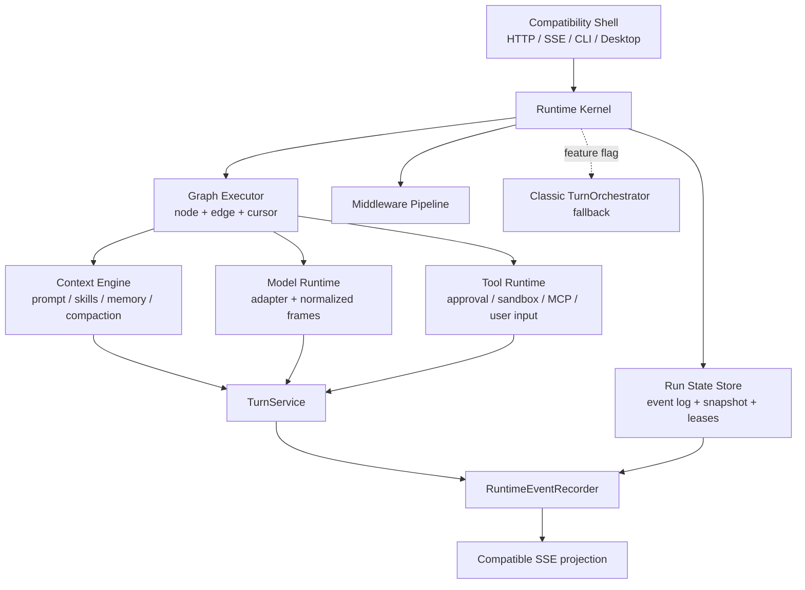
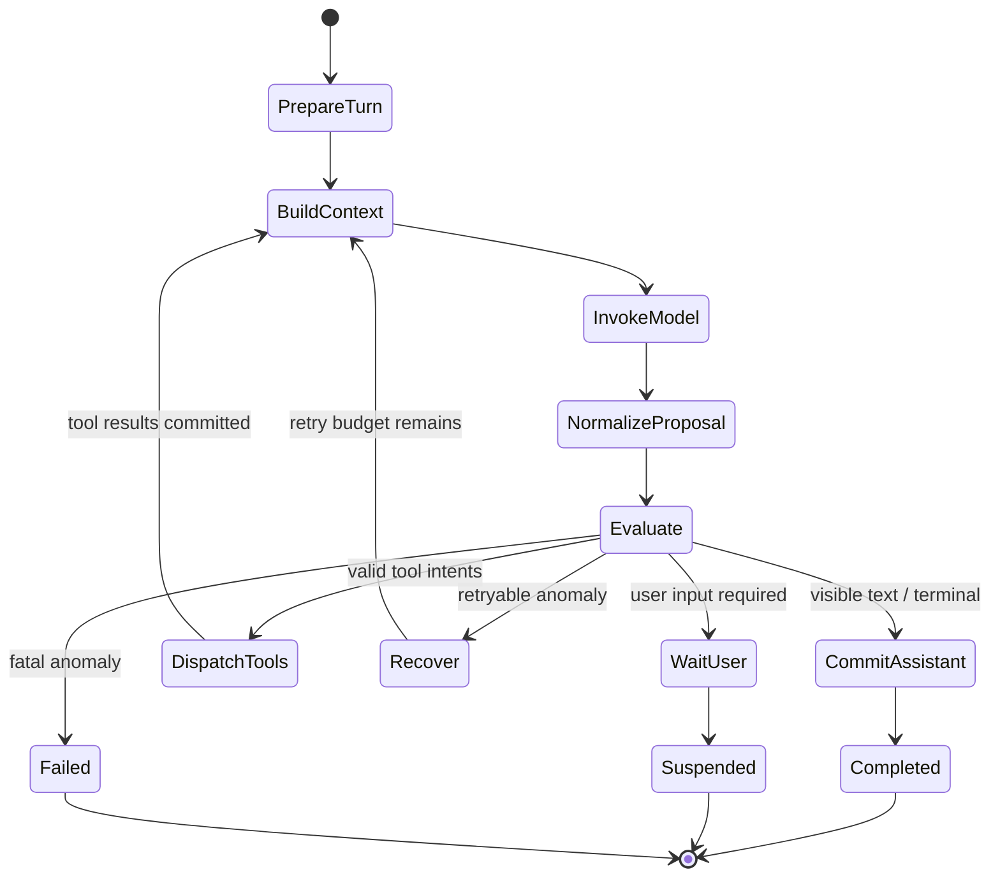

# QiongQi Runtime Kernel 渐进式重构规格

## 1. 文档状态

- 日期：2026-07-15
- 状态：待评审
- 决策：采用“渐进式新内核 + classic loop 回退”
- 参考：DeerFlow 主分支提交 `8e96a6a252b882df6317cf3734ee9623b7429bff`
- 适用仓库：
  - KWorks 内嵌运行时：`/Users/libing/kk_Projects/KWorks/qiongqi`
  - QiongQi 上游仓库：`/Users/libing/kk_Projects/QiongQi`

本文定义 QiongQi 下一代运行时内核的目标架构、状态语义、兼容边界和迁移顺序。本文不是一次性重写方案，也不授权在规格评审前修改核心实现。

## 2. 背景与问题

QiongQi 的经典 loop 已经能够完成提示词构建、模型流式调用、工具执行、上下文压缩、技能注入、记忆检索、审批、SSE 事件和任务终态处理。近期针对 MiniMax M3、Kimi、本地 vLLM DeepSeek 量化模型和 OpenRouter 模型的修复，也已经补上了以下保护：

- 工具调用泄漏兼容；
- 非终态 action preamble 续跑；
- 最大 step 预算；
- 工具执行后空终态重试和 fallback；
- 压缩后“无法还原任务、请用户重述”的恢复防退化；
- owner、thread、workspace 和 memory scope 隔离。

这些修复有效，但共同暴露了一个结构问题：运行时治理逻辑分散在 `PromptBuilder`、`ModelStepRunner`、`LoopPolicy`、`LoopEvaluator`、`TurnOrchestrator`、`ToolCallCoordinator` 和模型适配器中。模型输出既是数据，又在事实上决定控制流；检查点只覆盖整个 step 的起点，不能精确描述模型响应已提交、工具已部分执行或恢复提示已注入后的状态。

因此，不同模型的细微协议差异会被放大为以下用户问题：

1. 模型生成了工具调用语法，但适配器没有识别，原始协议文本泄漏到主界面。
2. 模型在工具执行后给出空响应、半截响应或“接下来将执行”时，loop 误判为完成或无限续跑。
3. 上下文压缩后，摘要、当前目标、已完成动作和下一步没有统一的持久恢复胶囊，模型可能要求用户重述或切换到错误任务。
4. 崩溃恢复从整个 step 重跑，可能重复模型输出、工具副作用或 SSE 事件。
5. thread、turn、run、用户和工作区的状态键没有在所有治理组件中统一，进程内 Map 容易产生串任务或旧 run 污染。
6. provider stop reason 被压缩成 `stop | tool_calls | length | error`，引擎看不到 safety、refusal、malformed tool call、server parser failure 等真实原因。

## 3. 已有基础

本次重构必须演进现有能力，不另起炉灶。以下组件保留并逐步内聚到新内核：

| 现有组件 | 新架构中的定位 |
| --- | --- |
| `PromptBuilder` | Context Engine 兼容 facade，内部逐步拆成 context middleware |
| `ModelStepRunner` | Model Runtime 的流消费与 proposal 构建器 |
| `ToolCallCoordinator` | Tool Runtime facade，承接审批、沙箱、MCP、用户输入和副作用提交 |
| `LoopPolicy` / `LoopEvaluator` | 迁移为 terminal、recovery、budget 等 middleware |
| `LoopPlan` | 升级为有节点、边和条件的 `ExecutionGraph` |
| `LoopRunner` | 升级为解释 graph 和 middleware 的 `RuntimeKernel` |
| `TurnStateStore` | 升级为 checkpoint + snapshot store |
| `RuntimeEventRecorder` | 继续作为运行时事件的唯一编号、持久化和发布入口 |
| `TurnService` | 继续作为 thread、turn、item 状态的唯一变更入口 |
| `ModelCompatClient` | 继续负责协议适配，输出更完整的规范化 model frame |
| `TurnOrchestrator` | classic 回退路径和行为对照基线 |
| HTTP/SSE/CLI/Desktop | Compatibility Shell，不感知内核重构 |

当前 `EventedTurnOrchestrator`、`LoopRunner`、`LoopPlan` 和 `TurnStateV2` 已经证明双轨运行可行，但还存在三个缺口：

- `LoopRunner.step()` 仍按硬编码顺序执行，`phaseCursor` 不是实际解释器游标；
- 检查点只在 step 开始前保存，缺少阶段级副作用提交边界；
- `LoopRun.events` 与 `RuntimeEventRecorder` 事件没有统一的事实源和投影契约。

## 4. 目标

### 4.1 必须实现

1. 将控制流从模型自然语言中移出，交给确定性的运行时状态机。
2. 建立 `Thread -> Turn -> Run -> Step -> NodeAttempt` 生命周期和稳定标识。
3. 建立可组合、可排序、可审计的 middleware chain。
4. 支持阶段级 checkpoint、崩溃恢复和幂等副作用提交。
5. 将模型协议统一为 provider-neutral 的结构化 frame，同时保留原始 provider metadata。
6. 将上下文压缩、任务恢复、技能上下文和记忆隔离统一纳入 Context Engine。
7. 保留现有 `/v1`、KWorks `/api` 兼容路由、SSE、桌面协议、CLI 和现有数据。
8. 支持按运行时、线程或灰度配置切换 `classic` 与 `kernel_v3`，出现回归时可立即回退。
9. 所有核心实现和测试同步到 KWorks 内嵌 QiongQi 与本地上游 QiongQi。

### 4.2 成功标准

- DeepSeek 官方、MiniMax M3 官方、Kimi 官方、本地 vLLM 和 OpenRouter 至少各有一组端到端 contract test。
- 同一任务在模型空响应、错误 stop reason、半截工具调用、上下文压缩和进程重启后能够得到确定的结构化 outcome。
- 不同 owner、thread、turn、run 和 workspace 的恢复状态、记忆、循环检测、预算和工具结果互不污染。
- 恢复过程中不会重复已提交的文件写入、命令执行、审批请求、用户输入请求或 UI completed item。
- classic 与 kernel_v3 对相同 fixture 产生兼容的用户可见 item 和 SSE 事件。

## 5. 非目标

- 不引入 LangGraph、LangChain 或 Python 运行时依赖。
- 不复制 DeerFlow 的全部功能或 middleware 名单。
- 不在本轮改变前端消息协议、现有 HTTP 路由或桌面启动方式。
- 不在内核重构中重新设计金融、coding 工作模式或技能内容。
- 不承诺任意模型都具备相同能力；不支持原生工具调用的模型只能进入受限文本模式或明确失败。
- 不实现跨机器分布式事务；本阶段目标是单机本地优先运行时的可靠恢复。
- 不在迁移完成前删除 classic loop。

## 6. 设计原则

### 6.1 运行时拥有控制流

模型只提交 proposal：文本、reasoning、工具调用意图和 provider metadata。是否继续、重试、等待、执行工具或终止由内核根据结构化状态决定。

### 6.2 事件是事实，快照是缓存

持久运行事件是恢复和审计的事实源。快照用于快速启动，可由事件重建。SSE 是事件的兼容投影，不是事实源。

### 6.3 副作用必须可识别、可提交、可重放

每个模型请求、工具调用、审批请求、用户输入请求和 item 物化动作都必须有稳定幂等键。重放可以再次计算纯逻辑，但不能重复已提交副作用。

### 6.4 隔离键必须完整

所有可变运行状态至少绑定：

```text
ownerUserId + threadId + turnId + runId
```

涉及 workspace、子任务或工具时继续附加：

```text
workspaceId/path + stepId + nodeId + attempt + toolCallId
```

任何缺少 owner 的兼容调用都映射到显式 `local-default-owner`，不能使用无边界的全局默认 Map。

### 6.5 兼容优先于纯化

新内核先产生与现有 item/event/API 兼容的投影，再逐步替换内部实现。迁移期允许 facade 和 adapter 存在。

### 6.6 中间件顺序是公开契约

参考 DeerFlow 的经验，中间件不是随意注册的插件列表。每个 hook 有稳定顺序、锚点和依赖校验；冲突或循环依赖在启动时失败。

## 7. 目标架构



### 7.1 Runtime Kernel

Runtime Kernel 负责：

- 创建和恢复 run；
- 获取 run lease，防止同一 run 并发执行；
- 解释 execution graph；
- 在 hook 点执行 middleware；
- 在节点前后保存 checkpoint；
- 提交结构化 outcome；
- 将异常转成可审计的 failure，不让异常状态伪装成 completed。

Runtime Kernel 不负责：

- 拼接具体提示词；
- 解析厂商 SSE；
- 直接执行 shell 或 MCP；
- 直接写 thread/item；
- 直接构造前端 SSE payload。

### 7.2 Graph Executor

首版不是通用 DAG 平台，只支持 QiongQi loop 所需的有向状态图。默认图：



图定义必须包含稳定 `graphVersion`，每个节点包含：

```ts
type RuntimeNode = {
  id: string
  kind: RuntimeNodeKind
  effect: 'pure' | 'model' | 'tool' | 'state'
  retryPolicy?: RetryPolicy
  checkpoint: 'before' | 'after' | 'both' | 'none'
}

type RuntimeEdge = {
  from: string
  to: string
  when: OutcomeKind | RuntimePredicateId
}
```

条件必须引用注册过的 predicate id，不能在 JSON 中执行任意代码。

### 7.3 Middleware Pipeline

首版 hook：

```ts
type RuntimeHook =
  | 'beforeRun'
  | 'beforeNode'
  | 'beforeModel'
  | 'afterModel'
  | 'beforeTool'
  | 'afterTool'
  | 'afterNode'
  | 'beforeCommit'
  | 'afterCommit'
  | 'afterRun'
  | 'onError'
  | 'onResume'

interface RuntimeMiddleware {
  readonly id: string
  readonly version: number
  readonly hooks: readonly RuntimeHook[]
  readonly before?: readonly string[]
  readonly after?: readonly string[]
  readonly stateSchema?: MiddlewareStateSchema
  handle(ctx: MiddlewareContext, next: MiddlewareNext): Promise<MiddlewareResult>
}
```

`MiddlewareContext` 只暴露当前 hook 需要的最小权限。默认 middleware 不能直接写文件、修改 thread 或调用模型；需要副作用时返回 command，由 Kernel 在 commit 阶段执行。

`MiddlewareResult` 可返回：

```ts
type MiddlewareCommand =
  | { kind: 'continue' }
  | { kind: 'patch-proposal'; patch: ProposalPatch }
  | { kind: 'inject-context'; entry: DurableContextEntry }
  | { kind: 'jump'; nodeId: string; reason: string }
  | { kind: 'suspend'; reason: SuspensionReason }
  | { kind: 'terminate'; outcome: RunOutcome }
  | { kind: 'fail'; error: RuntimeFailure }
```

禁止 middleware 通过构造用户可见文本隐式改变控制流。

## 8. 默认中间件与顺序

默认链按以下顺序注册，并通过 before/after 锚点校验：

同一 hook 内按表格从上到下执行，不采用反向 after-hook 语义。需要包裹副作用的 middleware 通过 `next` 显式形成局部洋葱；不能依赖框架自动反转顺序。

| 顺序 | Middleware | 主要 hook | 责任 |
| --- | --- | --- | --- |
| 1 | `IdentityScopeMiddleware` | `beforeRun`, `onResume` | 校验 owner/thread/turn/run/workspace 一致性 |
| 2 | `LeaseMiddleware` | `beforeRun`, `afterRun` | 单 run 执行租约和进程崩溃接管 |
| 3 | `BudgetMiddleware` | `beforeNode`, `afterModel`, `afterTool` | step、token、cost、wall-time、tool 次数预算 |
| 4 | `ContextRecoveryMiddleware` | `beforeModel`, `afterModel`, `onResume` | 恢复胶囊、压缩后退化识别 |
| 5 | `HistoryIntegrityMiddleware` | `beforeModel` | dangling/orphan tool history 修复和 provider 合法性 |
| 6 | `ModelProtocolMiddleware` | `afterModel` | stop reason、tool frame、reasoning/text 归一 |
| 7 | `SafetyTerminationMiddleware` | `afterModel` | safety/refusal 截断时抑制半截工具调用 |
| 8 | `LoopDetectionMiddleware` | `afterModel`, `afterTool` | 稳定工具指纹、频率窗口、warn/hard stop |
| 9 | `RequiredActionMiddleware` | `afterModel` | required tool、plan、review 等确定性约束 |
| 10 | `TerminalResponseMiddleware` | `afterModel` | 工具后空终态一次恢复和结构化降级 |
| 11 | `ToolPolicyMiddleware` | `beforeTool` | 权限、审批、沙箱、allow-list |
| 12 | `ToolResultMiddleware` | `afterTool` | 结果预算、artifact 外置、错误归一 |
| 13 | `CommitIntegrityMiddleware` | `beforeCommit`, `afterCommit` | 幂等键、重复提交和终态单调性 |
| 14 | `MemoryCaptureMiddleware` | `afterCommit`, `afterRun` | owner/thread/workspace 隔离的记忆提取 |
| 15 | `ObservabilityMiddleware` | 全部 | trace、事件、耗时、结构化 stop reason |

关键排序约束：

- `HistoryIntegrity` 必须早于模型请求序列化。
- `SafetyTermination` 必须早于 `LoopDetection`，避免半截工具调用计入循环并被执行。
- `ModelProtocol` 必须早于所有基于 proposal 的 evaluator。
- `ToolPolicy` 必须早于任何 tool side effect。
- `CommitIntegrity` 必须包住所有 state commit。
- `IdentityScope` 和 `Lease` 不允许被第三方 middleware 绕过。

## 9. 状态模型

### 9.1 标识关系

```text
Owner
  └─ Thread
      └─ Turn
          └─ Run (一次执行或恢复谱系)
              └─ Step (一次模型决策循环)
                  └─ NodeAttempt (某节点的一次尝试)
```

- `threadId`：用户对话边界。
- `turnId`：一次用户请求边界。
- `runId`：该 turn 的一次执行谱系；进程恢复和 middleware 内部恢复保持同一 runId，用户显式“重新执行”或 fork 才创建新 runId。
- `stepId`：确定性生成，建议 `${runId}:step:${index}`。
- `nodeAttemptId`：`${stepId}:${nodeId}:${attempt}`。

### 9.2 RunStateV3

```ts
type RunStatus =
  | 'created'
  | 'running'
  | 'suspended'
  | 'completed'
  | 'degraded'
  | 'failed'
  | 'aborted'

type RunStateV3 = {
  version: 3
  graphVersion: string
  runtimeMode: 'kernel_v3'
  ownerUserId: string
  threadId: string
  turnId: string
  runId: string
  parentRunId?: string
  workspaceKey: string
  status: RunStatus
  cursor: {
    stepIndex: number
    nodeId: string
    attempt: number
    checkpointSeq: number
  }
  budgets: BudgetState
  recovery: RecoveryState
  middleware: Record<string, VersionedMiddlewareState>
  pendingEffects: EffectIntent[]
  committedEffects: CommittedEffectRef[]
  outcome?: RunOutcome
  createdAt: string
  updatedAt: string
}
```

### 9.3 终态单调性

终态一旦提交，不允许被晚到事件降级为运行中：

```text
created -> running
running -> suspended | completed | degraded | failed | aborted
suspended -> running | aborted | failed
```

`completed/degraded/failed/aborted` 均为终态。恢复只能从 `running`、过期 lease 或可恢复的 `suspended` 开始。

### 9.4 结构化 outcome

```ts
type RunOutcome = {
  status: 'completed' | 'degraded' | 'failed' | 'aborted' | 'suspended'
  reason:
    | 'normal_stop'
    | 'awaiting_user_input'
    | 'tool_completed_no_final_text'
    | 'context_recovery_exhausted'
    | 'loop_capped'
    | 'step_capped'
    | 'token_capped'
    | 'cost_capped'
    | 'provider_safety_stop'
    | 'provider_protocol_error'
    | 'required_action_missing'
    | 'tool_failed'
    | 'user_aborted'
    | 'runtime_error'
  userVisibleItemId?: string
  retryable: boolean
  details?: Record<string, unknown>
}
```

前端继续显示 assistant item，但诊断、续跑和上层编排读取 `RunOutcome`，不解析 fallback 文本。

## 10. 事件、快照与检查点

### 10.1 事实源

新增 `RunEventStore` port，事件通过 `RuntimeEventRecorder` 分配单调序号并持久化。序号沿用现有语义，在 thread 内单调递增；`RunStateV3.cursor.checkpointSeq` 保存该 run 已归并的最高 thread event seq。首版可以复用现有 JSONL/SQLite hybrid 基础设施。

核心事件示例：

```text
run.created
run.resumed
node.started
model.requested
model.frame.received
proposal.normalized
middleware.applied
effect.prepared
effect.committed
node.completed
run.suspended
run.completed
run.failed
```

每个事件包含：

```ts
type RunEventEnvelope = {
  eventId: string
  seq: number
  ownerUserId: string
  threadId: string
  turnId: string
  runId: string
  stepId?: string
  nodeAttemptId?: string
  eventType: string
  idempotencyKey?: string
  payload: unknown
  timestamp: string
}
```

### 10.2 快照

`RunSnapshotStore` 保存 `RunStateV3`，默认在以下位置写快照：

- run 创建后；
- 每个 node 开始前；
- model proposal 归一后；
- effect prepare 后；
- effect commit 后；
- suspend 或终态提交后。

快照写入必须使用原子替换。加载时先读最新快照，再重放 `checkpointSeq` 之后的事件。

### 10.3 不删除终态快照

现有 `EventedTurnOrchestrator` 在 completed/failed/aborted 后删除 state。V3 不删除终态记录，只按 retention policy 压缩：

- 完整事件保留期可配置；
- 终态 snapshot 和 outcome 长期保留；
- 大 payload 外置到 artifact/output，仅事件保留 digest 和引用。

### 10.4 lease 与并发

`RunLeaseStore` 至少提供：

```ts
acquire(runId, holderId, ttlMs): Promise<LeaseResult>
renew(runId, holderId, ttlMs): Promise<boolean>
release(runId, holderId): Promise<void>
```

恢复者只能接管过期 lease。相同 owner/thread/turn 允许多个历史 run，但同一 active run 同时只有一个 holder。

## 11. 副作用与幂等

### 11.1 两阶段 effect

所有非纯节点使用 prepare/commit：

1. `effect.prepared`：记录意图、参数 digest、policy 决定和 idempotency key。
2. 执行副作用。
3. `effect.committed`：记录结果 digest、artifact ref、item id 和状态。

幂等键示例：

```text
model:${runId}:${stepId}:${attempt}
tool:${runId}:${toolCallId}
approval:${runId}:${toolCallId}
user-input:${runId}:${requestId}
item:${runId}:${logicalItemKind}:${logicalIndex}
```

### 11.2 工具分类

工具注册时声明：

```ts
type ToolEffectPolicy = {
  effect: 'read' | 'idempotent-write' | 'non-idempotent-write'
  replay: 'safe' | 'verify-first' | 'never'
  concurrencyKey?: string
}
```

- `read`：可安全重试。
- `idempotent-write`：相同幂等键可返回已提交结果。
- `non-idempotent-write`：崩溃发生在调用后、commit 前时进入 `suspended`，必须通过 verification hook 确认结果，不能盲目重跑。

### 11.3 模型调用

模型调用通常无法从 provider 获得幂等保证。若 `model.requested` 已写但没有完整 `proposal.normalized`：

- 丢弃未完成的 streaming item 投影；
- attempt + 1 后重试；
- 已输出到 UI 的 partial item 标为 `failed` 或 `superseded`；
- 不把 partial tool call 交给 Tool Runtime。

## 12. Model Runtime

### 12.1 规范化 frame

扩展 `ModelStreamChunk` 的 completed/error 信息，但保持旧字段兼容：

```ts
type NormalizedModelCompletion = {
  stopClass:
    | 'final'
    | 'tool_intent'
    | 'length'
    | 'safety'
    | 'refusal'
    | 'protocol_error'
    | 'transport_error'
    | 'unknown'
  providerReason?: string
  provider: string
  endpointFormat: 'chat_completions' | 'responses' | 'messages'
  rawMetadata?: Record<string, unknown>
}
```

模型适配器必须在输出 frame 前完成：

- 官方 tool call 和兼容 tool call 解析；
- reasoning/text 分离；
- provider special token 清理；
- tool arguments JSON 归一；
- finish/stop reason 映射；
- parser-required 配置错误识别；
- raw metadata 脱敏后保留。

### 12.2 Proposal 与 commit 分离

`ModelStepRunner` V3 先构造 `ModelProposal`：

```ts
type ModelProposal = {
  text: string
  reasoning: string
  toolIntents: ToolIntent[]
  completion: NormalizedModelCompletion
  usage?: UsageSnapshot
  integrity: {
    complete: boolean
    toolCallsPaired: boolean
    leakedProtocolText: boolean
  }
}
```

proposal 经过 middleware/evaluator 后，`CommitAssistantNode` 才创建 completed assistant item；streaming delta 可以继续实时投影，但其状态是 provisional。

### 12.3 能力协商

每次 run 冻结一个 `ModelCapabilitySnapshot`，包含：

- endpoint format；
- native tool calling；
- parallel tool calls；
- reasoning dialect；
- strict alternation；
- assistant content requirement；
- max context/output；
- provider parser requirements。

同一 run 中配置漂移时不热切换。用户修改模型配置后，新 run 使用新 snapshot。

## 13. Context Engine 与压缩恢复

### 13.1 Durable Task Capsule

压缩前生成结构化恢复胶囊，不仅生成自然语言摘要：

```ts
type DurableTaskCapsule = {
  version: 1
  ownerUserId: string
  threadId: string
  turnId: string
  runId: string
  objective: string
  constraints: string[]
  completedActions: Array<{ kind: string; resultRef?: string; summary: string }>
  pendingActions: Array<{ kind: string; description: string; priority: number }>
  activePlan?: { planId: string; currentStep?: string }
  activeSkills: Array<{ id: string; version?: string }>
  artifacts: Array<{ id: string; path?: string; digest?: string }>
  toolLedger: Array<{ callId: string; toolName: string; status: string; resultRef?: string }>
  sourceDigest: string
  createdAt: string
}
```

自然语言 summary 用于模型理解，`DurableTaskCapsule` 用于运行时恢复和一致性校验。胶囊字段作为数据注入，并附加 authority contract：字段值可能包含用户、模型和工具文本，不得作为系统指令执行。

### 13.2 压缩事务

压缩流程：

1. 冻结待压缩 item ids 和 source digest。
2. 从持久状态生成 task capsule。
3. 调用摘要模型；摘要失败时保留原历史并推迟压缩。
4. 写入 compaction event、summary item 和 capsule ref。
5. 校验 preserved tail 包含当前 turn 所有未提交工具配对。
6. 原子提交新的 history projection。

### 13.3 恢复规则

恢复时 Kernel：

- 先从 `RunStateV3` 获取 objective、cursor 和 pending effects；
- 再用 capsule 恢复模型上下文；
- 不从最近 assistant 文本猜测当前任务；
- 若模型要求重述，但 capsule 有 objective，则触发 `ContextRecoveryMiddleware`；
- 恢复预算耗尽后返回结构化 `context_recovery_exhausted`，不能静默切换任务。

## 14. 记忆与多用户隔离

### 14.1 统一 ScopeKey

```ts
type ScopeKey = {
  ownerUserId: string
  tenantId?: string
  workspaceKey?: string
  threadId?: string
  turnId?: string
  runId?: string
  purpose: 'runtime' | 'memory' | 'skill' | 'tool' | 'observability'
}
```

各 store 和 middleware 不再自行拼接 Map key。统一 `ScopeKeyCodec` 负责规范化、编码和校验。

### 14.2 读取规则

- runtime state：必须精确匹配 owner/thread/turn/run。
- thread memory：必须匹配 owner/thread。
- project memory：必须匹配 owner/workspace，且明确允许跨 thread。
- global user memory：必须匹配 owner，不能跨 owner。
- observability：按 owner 过滤后才能按 thread/run 查询。
- 子任务：继承 owner，使用独立 thread/run，显式记录 parentRunId。

### 14.3 写入规则

任何无 owner 的外部请求先在 Compatibility Shell 解析 owner。内核收到缺 owner 的 `RunIdentity` 必须失败，不允许回退到共享内存空间。

## 15. Tool Runtime

Tool Runtime 统一承接：

- 内置工具；
- MCP 工具；
- skill tools；
- 审批；
- 用户输入；
- sandbox 和 workspace boundary；
- result budget 和 artifact 外置；
- tool storm/loop 统计。

每个 tool intent 在执行前必须通过：

```text
schema validation
-> provider/tool name normalization
-> identity/workspace scope validation
-> skill allow-list
-> approval policy
-> effect policy
-> idempotency lookup
-> execution
-> result normalization
-> commit
```

模型输出中出现 `(tool call)`、`<action>`、`name="bash"` 等文本时，只有模型适配器生成了合法 `ToolIntent` 才能执行。纯文本协议片段进入 `leakedProtocolText` 检测，不通过正则直接构造工具调用。

## 16. Compatibility Shell

以下外部行为在迁移期保持不变：

- `POST /v1/threads/:id/turns`；
- `GET /v1/threads/:id/events`；
- 现有 item schema 和主要 RuntimeEvent schema；
- KWorks `/api` 兼容路由；
- Electron embedded gateway 启动参数；
- CLI `serve/run/chat/exec`；
- 前端 `Last-Event-ID` SSE 恢复。

Compatibility Shell 负责将 V3 事件投影为现有事件。新增字段只做 additive extension，例如：

```json
{
  "runtime": {
    "mode": "kernel_v3",
    "run_id": "run_...",
    "outcome_reason": "loop_capped"
  }
}
```

前端在未升级时忽略这些字段。

## 17. 配置与切流

将现有 `orchestrationMode: 'classic' | 'evented'` 演进为：

```ts
type OrchestrationMode = 'classic' | 'evented_v2' | 'kernel_v3'

type KernelRolloutConfig = {
  defaultMode: OrchestrationMode
  allowThreadOverride: boolean
  shadowCompare?: boolean
  fallbackOnStartupFailure: boolean
}
```

规则：

- 初期默认仍为 `classic`。
- `evented` 作为配置别名映射到 `evented_v2`，保持兼容。
- `shadowCompare` 只允许对已录制的 model frame 和 tool result 重放纯节点与投影逻辑；不得额外调用真实模型、执行工具、请求审批或写用户数据。
- kernel_v3 不在同一 turn 中自动切回 classic；如果 V3 已产生副作用，自动 fallback 会造成重复执行。
- 只有 run 创建前或明确无副作用的启动失败允许 fallback。
- thread override 写入 thread metadata，新 turn 继承；已有 active run 不热切换。

## 18. 迁移阶段

### 阶段 0：契约冻结与基线

- 固化 classic loop 的 golden fixtures、事件序列和 provider contract tests。
- 建立双仓同步脚本或校验，确保核心文件不漂移。
- 为现有 evented_v2 状态和事件补齐真实缺口测试。

退出条件：classic 行为基线可重复，双仓差异可自动检测。

### 阶段 1：V3 状态与持久化骨架

- 增加 `RunStateV3`、`RunEventStore`、`RunSnapshotStore`、lease 和 reducer。
- 暂不调用真实模型/工具，用 deterministic fake graph 验证恢复。
- 保留 V1/V2 读取升级，不做 V3 向旧版本降级写回。

退出条件：任意节点 kill -9 后能从相同 cursor 恢复，终态单调。

### 阶段 2：Middleware Kernel

- 实现 hook、排序、锚点、状态 schema 和 command 模型。
- 先迁移 budget、terminal response、context recovery、loop detection。
- classic 逻辑保留，V3 通过 adapter 调用相同底层组件。

退出条件：middleware 顺序、隔离、重试预算和审计事件测试通过。

### 阶段 3：Model Runtime 与 proposal/commit

- 扩展 provider-neutral completion metadata。
- 将 streaming delta 标为 provisional。
- 将模型输出物化从 stream consumption 移到 commit node。
- 迁移 history integrity 和 safety termination。

退出条件：五类 provider contract fixtures 均通过，不再依赖用户可见文本判断协议状态。

### 阶段 4：Tool Runtime 幂等恢复

- 增加 effect policy、prepare/commit 和 idempotency lookup。
- 迁移审批、用户输入、artifact 外置和 tool storm。
- 对 bash/write/edit/MCP 建立崩溃点测试。

退出条件：工具执行前后任一崩溃点恢复不产生重复副作用。

### 阶段 5：Context Engine 与记忆隔离

- 引入 Durable Task Capsule 和 ScopeKey。
- 将 PromptBuilder 内部职责逐步迁移为 middleware。
- 增加压缩、恢复、fork、子任务和多用户隔离测试。

退出条件：压缩后不丢任务，不串任务，不跨 owner/workspace 读写记忆。

### 阶段 6：灰度与默认切换

- 开发环境和测试环境默认 kernel_v3。
- 桌面发布按配置灰度，采集 outcome 和 fallback 指标。
- 通过 parity gate 后将新建 thread 默认切到 kernel_v3。
- classic 至少保留两个稳定发布周期。

退出条件：关键模型矩阵连续 7 天无阻断回归，kernel_v3 启动前的 classic fallback 低于新建 run 的 1%，且无数据迁移阻断。

### 阶段 7：收敛

- 删除 evented_v2 重复实现，保留 V1/V2 状态读取迁移器。
- 将 classic 标为 deprecated，但不在同一发布中删除。
- 更新架构文档和 SDK 示例。

## 19. 测试策略

### 19.1 单元测试

- graph cursor 与 edge 选择；
- middleware 排序、锚点冲突和状态 reducer；
- outcome 单调性；
- ScopeKey 编码与 owner 隔离；
- completion metadata 映射；
- tool intent 完整性；
- recovery budget；
- effect idempotency。

### 19.2 状态机属性测试

生成随机事件序列，验证：

- 终态不能回到 running；
- committed effect 最多一次；
- cursor 只按合法 edge 前进；
- owner/thread/run 不匹配的事件不能归并；
- replay(snapshot + events) 等于在线 state。

### 19.3 崩溃注入测试

在每个 checkpoint 注入进程终止：

- model request 前、流式中、proposal 后；
- tool prepare 前、执行中、commit 后；
- compaction summary 前后；
- approval 和 user input 前后；
- SSE 发布前后。

### 19.4 Provider contract matrix

每类 provider 使用录制 fixture 和可选 live smoke：

| Provider | 重点 |
| --- | --- |
| DeepSeek 官方 | 正常 tool calls、reasoning、length stop |
| MiniMax M3 官方 | 官方协议、reasoning/tool 分离、空终态 |
| Kimi 官方 | strict history、tool pairing、stop reason |
| 本地 vLLM DeepSeek | parser 配置、SSE delta、reasoning split |
| OpenRouter | 上游 provider metadata、兼容差异、free model 限制 |

live 测试必须由环境变量显式开启，不能进入默认离线测试。

### 19.5 Parity 测试

同一 fixture 分别运行 classic 与 kernel_v3，对比：

- 用户可见 assistant text；
- tool name/arguments/result；
- item 终态；
- SSE 关键事件顺序；
- usage；
- outcome。

允许新增 V3 审计事件，不允许删除前端依赖的兼容事件。

### 19.6 隔离测试

至少覆盖：

- 两个 owner 使用相同 thread id；
- 同一 owner 两个 thread 并行压缩；
- 同一 thread 两个 turn；
- 旧 run 的 middleware warning 不进入新 run；
- project memory 可跨 thread，但不可跨 owner/workspace；
- fork 复制历史但不复用 active run cursor；
- 子任务继承 owner，不复用父任务 tool ledger。

## 20. 可观测性

新增指标：

- `qiongqi_run_outcome_total{mode,provider,reason}`；
- `qiongqi_node_attempt_total{node,outcome}`；
- `qiongqi_recovery_total{kind,result}`；
- `qiongqi_effect_deduplicated_total{tool}`；
- `qiongqi_context_compaction_total{result}`；
- `qiongqi_scope_violation_total{purpose}`；
- `qiongqi_middleware_duration_ms{middleware,hook}`；
- `qiongqi_classic_fallback_total{reason}`。

日志必须包含 owner 的不可逆 hash、threadId、turnId、runId、stepId 和 nodeAttemptId。不得记录 API key、完整敏感 tool arguments 或 provider safety-filtered 内容。

## 21. 数据迁移

- V1/V2 `TurnState` 可升级为 V3 的恢复入口。缺失 owner 时优先读取对应 ThreadStore 的 `ownerUserId`；仅本地单用户兼容数据可以绑定 `local-default-owner`。若同一 thread id 存在多个 owner 候选或无法唯一确定，状态进入 quarantine，不自动恢复。
- 已完成的 V1/V2 状态不回填完整事件，只生成 migration snapshot 和 `state.migrated` 事件。
- 现有 ThreadStore、SessionStore 和 item 数据无需批量重写。
- 新事件和 snapshot 使用独立 schema version。
- 回退到 classic 时，classic 忽略 V3 run state；不得删除 V3 状态。

## 22. 双仓同步策略

QiongQi 核心实现以 `/Users/libing/kk_Projects/QiongQi` 为上游语义源，KWorks 的 `qiongqi/` 保持可构建镜像。每个实施阶段必须：

1. 在一个仓库完成最小、可验证的提交单元。
2. 同步相同核心文件和测试到另一个仓库。
3. 分别运行目标测试和 typecheck/build。
4. 使用路径无关的 diff 校验核心目录内容一致。
5. 分别提交，提交说明引用同一阶段和规格章节。

KWorks 专属桌面/兼容层改动不反向污染上游通用内核；若上游需要扩展点，先在上游定义 port，再由 KWorks 注入实现。

## 23. 风险与缓解

### 23.1 双事件系统造成复杂度

缓解：只允许 `RuntimeEventRecorder` 分配序号；V3 run event 和兼容 runtime event 使用明确 projection，不让组件双写。

### 23.2 幂等无法覆盖任意 shell 命令

缓解：将工具分为 read/idempotent/non-idempotent；不确定状态进入 suspended + verify-first，不承诺不可证明的 exactly-once。

### 23.3 middleware 过度碎片化

缓解：首版只迁移已存在的治理逻辑；每个 middleware 必须有独立状态 schema、单一责任和明确 hook，不创建只有一行转发的组件。

### 23.4 classic 与 V3 行为漂移

缓解：golden parity fixtures、shadow compare 只读模式和 release gate；classic 保留两个稳定发布周期。

### 23.5 PromptBuilder 拆分引发提示词回归

缓解：先保留 facade 和 byte-stable immutable prefix；以 request snapshot 测试逐项迁移，不一次性重写。

### 23.6 模型能力被错误推断

缓解：run 创建时冻结 capability snapshot；允许用户显式覆盖；provider adapter 记录原始脱敏 metadata；能力不足时明确降级或失败。

## 24. 验收门槛

只有同时满足以下条件，kernel_v3 才能成为默认模式：

1. 所有现有 classic 核心测试继续通过。
2. V3 单元、属性、崩溃注入、provider contract、parity 和隔离测试通过。
3. KWorks 与上游 QiongQi 核心代码 diff 校验通过。
4. 桌面开发和打包环境分别完成真实 SSE、恢复、工具执行和 artifact 冒烟。
5. MiniMax M3 官方、Kimi 官方、本地 vLLM DeepSeek 和至少一个 OpenRouter 模型完成代表性任务，不出现协议文本泄漏、静默停止或无限循环。
6. 上下文压缩后能从 durable capsule 自动续跑，且不会切换到其他任务。
7. 多 owner/thread/run 并发隔离测试无串数据。
8. 灰度期没有不可恢复的数据格式问题，classic fallback 可用。

## 25. 最终决策摘要

QiongQi 不需要“删除一切重新写”。正确的完全重构是保留现有外部协议和成熟组件，用新的 Runtime Kernel 逐层接管控制流：

```text
imperative classic loop
    -> persisted execution graph
    -> ordered middleware governance
    -> normalized model proposal
    -> idempotent effect commit
    -> durable context and scoped memory
```

DeerFlow 提供了经过实践验证的方向：状态图承载运行、middleware 承载治理、checkpoint 承载恢复、结构化 state 承载任务连续性。QiongQi 的实现仍保持 TypeScript、六边形 ports、本地优先、无 LangGraph 依赖，并通过双轨和兼容投影控制迁移风险。
