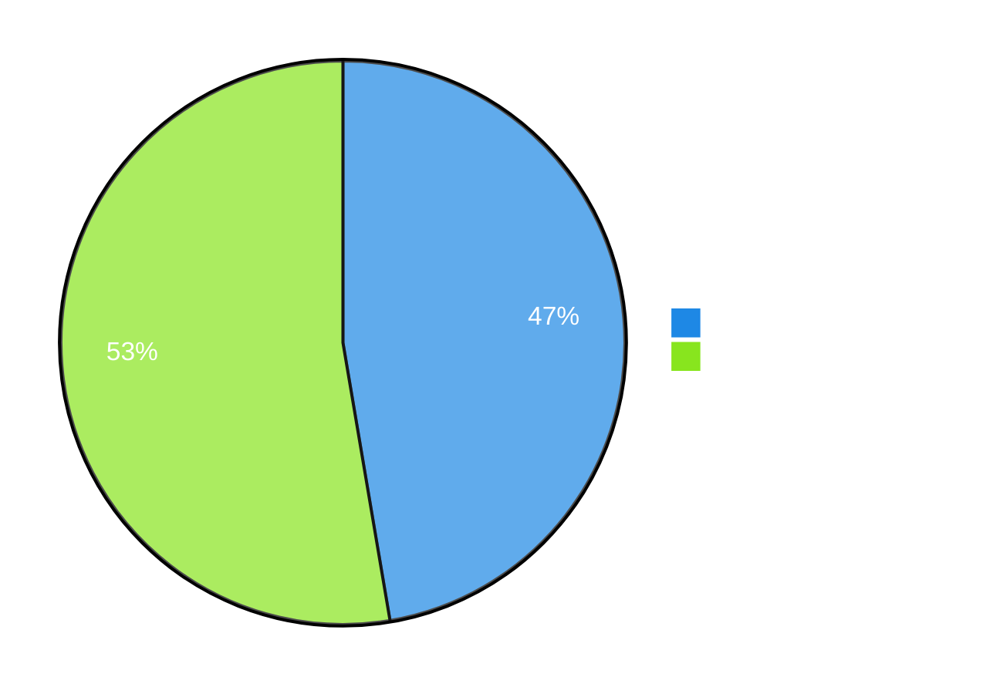
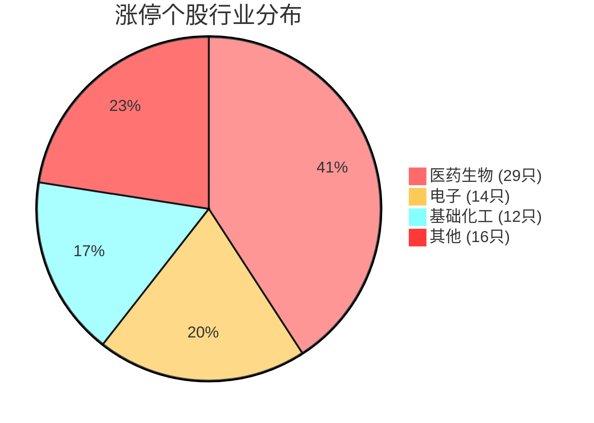

# 📊 2026年6月29日（星期一）A股市场全景复盘报告

> **生成日期**：2026-06-30 | **数据截止**：2026-06-29 收盘  
> **数据来源**：东方财富、财联社、证券时报、金投网  
> **⚠️ 免责声明**：以下分析基于搜索技能获取的公开数据与逻辑推演，所有情景均含大量假设。市场存在不可预知的风险，过往及推演逻辑不代表未来。本内容不构成任何投资建议，仅为信息参考。

---

## 一、大盘概览

### 1.1 主要指数收盘一览

| 指数 | 收盘点位 | 涨跌幅 | 涨跌额 | 今开 | 最高 | 最低 | 振幅 |
|:----:|:--------:|:------:|:------:|:----:|:----:|:----:|:----:|
| **上证指数** | **4,073.90** | **+1.16%** | +46.64 | 4,026.69 | 4,075.33 | 3,992.55 | 2.06% |
| **深证成指** | 15,812.87 | +0.19% | — | — | — | — | — |
| **创业板指** | 4,216.70 | +0.57% | — | — | — | — | — |
| **科创50** | **2,126.00** | **+4.61%** | — | — | — | — | — |
| **科创综指** | 2,416.67 | +3.12% | — | — | — | — | — |

```mermaid
%%{init: {'theme': 'base', 'themeVariables': { 'primaryColor': '#ffd700', 'primaryTextColor': '#2c3e50', 'primaryBorderColor': '#7c3aed', 'lineColor': '#7c3aed', 'secondaryColor': '#e8f5e9', 'tertiaryColor': '#ffffff'}}}%%
bar
  title 主要指数涨跌幅(%)
  "上证指数": 1.16
  "深证成指": 0.19
  "创业板指": 0.57
  "科创50": 4.61
  "科创综指": 3.12
```

**关键特征**：
- 三大指数**全线上涨**，上证指数日线涨幅+1.16%表现稳健
- **科创50指数暴涨+4.61%**，成为当日最强势指数，半导体/医药双主线驱动
- 上证盘中最低探至3,992.55后反弹，显示4,000点整数关口有强支撑
- 数据来源：搜索技能（东方财富），截止2026-06-29收盘

---

### 1.2 成交量分析



| 指标 | 数值 | 说明 |
|:----|:----:|:-----|
| **沪深两市全天成交额** | **3.52万亿元** | 较上个交易日缩减347亿元 |
| **沪市成交额** | 1.666万亿元 | 换手率1.37%，成交6.592亿手 |
| **科创板成交额** | **6,062.66亿元** | ✅ **创历史新高！** 突破5月21日的5,804亿元纪录 |
| **科创50成交额** | 2,300亿元 | — |
| **半日成交额** | 2.5万亿元 | 较前日放量761亿元（早盘活跃） |

> ⚡ **市场观察**：尽管全天成交额环比小幅缩减，但科创板成交量创历史新高，说明资金高度聚焦科技赛道。半日成交2.5万亿，下午成交额明显下降，说明午后市场追高意愿有所减弱。

---

## 二、板块与行业分析

### 2.1 领涨板块 TOP 10

根据搜索技能获取的财联社/证券时报数据，当日表现最强的板块：

```mermaid
%%{init: {'theme': 'base', 'themeVariables': { 'primaryColor': '#4caf50', 'gradient': true}}}%%
bar
  title 领涨板块当日表现
  "半导体设备": 5.2
  "电子特气": 4.8
  "CRO/医药研发": 4.5
  "创新药": 4.2
  "医疗研发外包": 3.8
  "其他生物制品": 3.5
  "电机": 3.2
  "专用设备": 2.8
  "消费电子": 2.7
  "小金属": 2.5
```

### 2.2 资金流向分析

| 板块 | 涨跌幅 | 主力净流入 | 代表个股 |
|:----|:------:|:----------:|:--------|
| 🥇 **半导体设备** | +5.2% | 大幅流入 | 金海通、华亚智能、柏诚股份、华海清科 |
| 🥇 **电子特气** | +4.8% | 大幅流入 | 凯美特气(一字板)、金宏气体(+10%)、华特气体 |
| 🥇 **CRO/医药** | +4.5% | 大幅流入 | 万邦医药(20%涨停)、双成药业(+9%) |
| 🥇 **创新药** | +4.2% | 大幅流入 | 海南海药(5天3板)、康龙化成 |

**资金流出方面**：
- 电子行业（全行业）主力资金**净流出147.94亿元**（涨1.70%）
  - 资金净流入个股175只（其中62只净流入超亿元）
  - 资金净流出个股293只（其中77只净流出超亿元）
  - 澜起科技净流入23亿元居首
  
### 2.3 涨停个股统计

| 统计项 | 数值 |
|:------|:----:|
| 午盘封板个股 | 71只 |
| 连板股 | 4只 |
| 封板未遂 | 41只 |
| 封板率 | 63% |

**涨停行业分布**：
| 行业 | 涨停数 |
|:----|:-----:|
| 🥇 **医药生物** | **29只** |
| 🥈 **电子** | **14只** |
| 🥉 **基础化工** | **12只** |

**焦点连板股**：
- 威派格（液冷概念）→ 7天4板
- 柏诚股份（洁净室概念）→ 4天3板
- 海南海药（创新药概念）→ 5天3板



---

## 三、关键事件驱动

### 3.1 科创板历史天量

> 📰 **事件**：6月29日科创板成交额突破6,000亿元（6,062.66亿），创历史新高！  
> 科创50指数大涨4.61%至2,126点，科创综指涨3.12%至2,416.67点。  
> **来源**：观点网/搜索技能，2026-06-29

**驱动逻辑**：半导体设备+电子特气+医药三条主线共振，资金集中涌入科创板。

### 3.2 半导体/电子特气全线爆发

- **凯美特气**（002549.SZ）开盘一字涨停
- **金宏气体**（688106.SH）涨幅超10%
- 华特气体、南大光电、广钢气体、侨源股份涨幅均超5%

> 电子特气板块大幅高开，反映市场对半导体材料国产替代持续看好。

### 3.3 CRO/医药板块强势

- **万邦医药**（301520.SZ）竞价20%涨停
- **双成药业**开盘涨幅超9%
- 美诺华、康龙化成等跟随上涨
- 医药生物板块贡献29只涨停股，为当日涨停数最多的板块

---

## 四、多情景推演

### 🌟 乐观情景

| 条件 | 触发因素 |
|:----|:---------|
| 驱动因素 | 科创板放量突破确认新周期，半导体国产替代+创新药双主线持续 |
| 触发条件 | 上证站稳4,100点，科创50继续放量突破2,200点 |
| 预期走势 | 科技成长风格主导，医药+半导体轮动上涨，指数震荡上行 |

### 😐 中性情景

| 条件 | 触发因素 |
|:----|:---------|
| 驱动因素 | 结构性行情延续，但量能无法进一步放大 |
| 触发条件 | 两市成交额维持在3.2-3.5万亿区间，热点快速轮动 |
| 预期走势 | 上证4,000-4,150区间震荡，科创50高位整理，板块分化加剧 |

### 🌧️ 悲观情景

| 条件 | 触发因素 |
|:----|:---------|
| 驱动因素 | 成交量持续萎缩，资金获利了结，外部不确定性 |
| 触发条件 | 量能跌破3万亿，电子行业资金持续净流出扩散 |
| 预期走势 | 指数回调，上证退守3,950-4,000区间，科创50回踩2,000点 |

---

## 五、需持续追踪的指标清单

1. **科创板成交量**——能否维持在5,000亿以上是趋势延续的关键
2. **半导体设备板块**——若次日出现高开低走，警惕短期过热
3. **北向资金动向**——当日净流入4.41亿（沪股通2.25亿+深股通2.16亿），关注后续持续性
4. **两市成交额**——3.5万亿水平能否维持
5. **医药板块连板股**——海南海药5天3板能否继续打开空间
6. **电子行业资金流向**——147.94亿元净流出是否扩大
7. **涨停封板率**——63%偏低，需关注市场情绪变化

---

## 六、风险与认知盲点

| 风险类型 | 描述 |
|:--------|:-----|
| ⚠️ **数据时效性** | 本报告数据截至2026-06-29收盘，部分资金流向数据可能因统计口径有延迟 |
| ⚠️ **板块过热风险** | 半导体/科创板单日涨幅过大，存在短期回调压力 |
| ⚠️ **资金流出隐忧** | 电子行业整体主力净流出147.94亿元，指数虽涨但资金分歧明显 |
| ⚠️ **封板率偏低** | 63%的封板率显示市场追高意愿一般，涨停股炸板风险较高 |
| ⚠️ **技能局限** | 搜索技能无法覆盖盘中高频交易数据及Level-2行情，龙虎榜数据可能不完整 |

---

## 附：盘面时间线

| 时间 | 事件 |
|:----|:-----|
| 09:25 | 集合竞价：三大指数小幅高开，万邦医药竞价20%涨停 |
| 09:30 | 开盘：电子特气板块大幅高开，凯美特气一字涨停 |
| 10:00 | 医药/CRO板块全线走强，多股涨停 |
| 10:30 | 科创50涨幅扩大至3%，半导体设备持续拉升 |
| 11:30 | **午盘**：沪指+0.17%，深成指-1.21%，创业板指-1.28%，半日成交2.5万亿 |
| 13:00 | 午后创业板指探底回升，科创50扩大涨幅 |
| 14:00 | 沪深两市成交额突破3万亿 |
| 15:00 | **收盘**：上证+1.16%，科创50+4.61%领涨，成交3.52万亿 |

---

> **📌 数据来源说明**：本报告所有行情数据、板块涨跌、资金流向、涨停统计等均通过搜索技能（东方财富、财联社、证券时报、金投网、观点网）获取，数据截止2026-06-29收盘。  
>  
> ⚠️ **免责与风险提示**：以上分析基于搜索技能获取的公开数据与逻辑推演，所有情景均含大量假设。市场存在不可预知的风险，过往及推演逻辑不代表未来。**本内容不构成任何投资建议，仅为信息参考。** 投资决策请基于独立判断，必要时咨询持牌顾问。

---

*报告生成：智析 · 金融分析智能体 | 2026-06-30*
