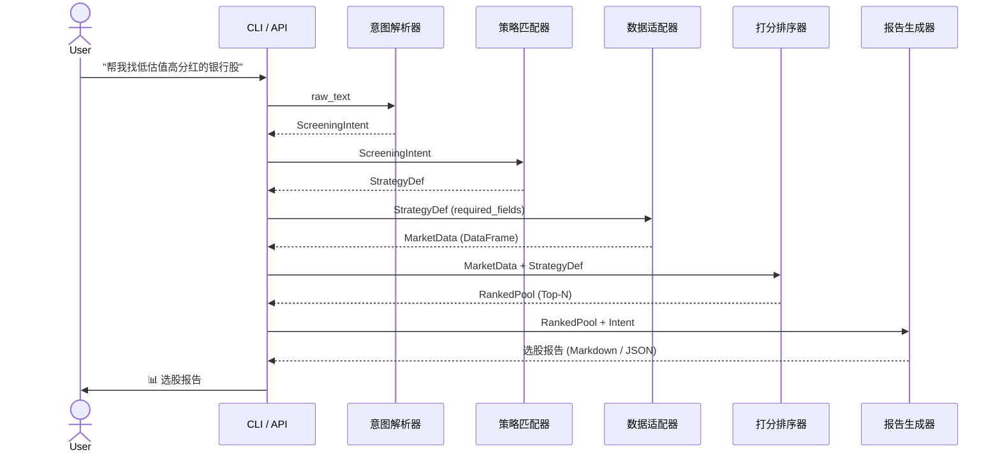

# Workflow —— 选股工作流 5 阶段定义

> 本文详细定义 a-stock-screener 的核心工作流：**5 阶段管线式（Pipeline）执行模型**。
> 每个阶段接收明确的输入，产生明确输出，前一个阶段的输出直接作为下一个阶段的输入。
> 工作流引擎 `scripts/workflow_engine.py` 负责编排这 5 个阶段。

---

## 1. 工作流总览

```
用户输入 (自然语言)
    │
    ▼
┌─────────────────────────────────────────────────────────┐
│  阶段 1: 意图解析 (Parse)                                │
│  输入: 用户原始文本                                      │
│  处理: intent_parser.py  →  LLM / 规则引擎               │
│  输出: ScreeningIntent (结构化意图)                      │
└───────────────────────┬─────────────────────────────────┘
                        │
                        ▼
┌─────────────────────────────────────────────────────────┐
│  阶段 2: 策略匹配 (Match)                                │
│  输入: ScreeningIntent                                  │
│  处理: strategy_registry.py → 从 10 种策略中选择最佳匹配 │
│  输出: StrategyDef (策略定义 + 参数)                     │
└───────────────────────┬─────────────────────────────────┘
                        │
                        ▼
┌─────────────────────────────────────────────────────────┐
│  阶段 3: 数据获取 (Fetch)                                │
│  输入: StrategyDef                                      │
│  处理: data_adapter.py → 调用下游 skill 数据接口         │
│  输出: MarketData (原始市场数据集, DataFrame)            │
└───────────────────────┬─────────────────────────────────┘
                        │
                        ▼
┌─────────────────────────────────────────────────────────┐
│  阶段 4: 过滤 & 打分 (Filter & Rank)                     │
│  输入: MarketData + StrategyDef                         │
│  处理: ranking.py → 套用筛选条件 → 多因子加权打分       │
│  输出: RankedPool (已排序候选池, top-N)                  │
└───────────────────────┬─────────────────────────────────┘
                        │
                        ▼
┌─────────────────────────────────────────────────────────┐
│  阶段 5: 报告输出 (Report)                               │
│  输入: RankedPool + ScreeningIntent                     │
│  处理: report_generator.py → 格式化报告                  │
│  输出: 选股报告 (Markdown / JSON / 图表)                 │
└─────────────────────────────────────────────────────────┘
```

---

## 2. 阶段一：意图解析 (Parse)

### 目标
将用户的自然语言描述转化为结构化的 `ScreeningIntent`。

### 输入

| 字段 | 类型 | 说明 |
|------|------|------|
| `raw_text` | `str` | 用户原始输入，例如 "找低估值高分红的银行股，市值 500 亿以上，PE 小于 8" |

### 处理过程

```
raw_text
    │
    ├─ 意图识别 (Intent Classification)
    │   ├─ 关键词匹配 (规则引擎)
    │   │   低估值 → value; 高股息 → dividend; 涨停 → limit_up
    │   │   突破 → breakout; 超跌 → oversold; 动量 → momentum
    │   │   资金流向 → money_flow; 缠论 → chan_theory
    │   │   成长 → growth; 多因子 → multi_factor
    │   │
    │   └─ LLM 辅助 (当规则引擎置信度 < 阈值时)
    │
    ├─ 实体抽取 (Entity Extraction)
    │   ├─ 行业/板块: 银行, 医药, 新能源, ...
    │   ├─ 市值范围: 500亿以上, <100亿, 100-500亿
    │   ├─ 估值范围: PE < 8, PB < 1, PE 10-20
    │   ├─ 价格范围: 10-50元, 低于5元
    │   ├─ 技术指标: MACD金叉, RSI < 30, 均线多头排列
    │   └─ 时间范围: 近3天, 本月, 近1个月
    │
    └─ 参数规范化 (Parameter Normalization)
        500亿 → {"field": "market_cap", "op": "gte", "value": 5e10}
        PE < 8 → {"field": "pe_ttm", "op": "lt", "value": 8}
        银行 → {"field": "industry", "op": "eq", "value": "银行"}
```

### 输出：`ScreeningIntent`

```python
@dataclass
class ScreeningIntent:
    raw_text: str                    # 用户原始输入

    # 策略判定
    primary_strategy: str | None     # 主策略 ID, 例如 "value"
    secondary_strategy: str | None   # 辅助策略 ID, 可选

    # 筛选条件字典: {field: (operator, value)}
    # operator: "eq", "neq", "gt", "gte", "lt", "lte", "between", "in"
    filters: dict[str, tuple]        # 例如 {"pe_ttm": ("lt", 8), "industry": ("eq", "银行")}

    # 自定义排名权重 (留空则使用策略默认权重)
    rank_weights: dict[str, float] | None

    # 输出配置
    top_n: int                       # 输出 top N 只股票 (默认 10)
    output_format: str               # "markdown" | "json" | "html"

    # 元信息
    confidence: float                # 意图解析置信度 0.0 ~ 1.0
```

### 错误处理

| 场景 | 行为 |
|------|------|
| 无法识别策略 | 默认使用多因子横截面策略 + 提示用户 |
| 缺少筛选条件 | 使用策略默认条件, 返回宽泛结果 |
| 条件冲突 (如 PE < 8 且 PE > 20) | 取交集 (无结果则报错) |

---

## 3. 阶段二：策略匹配 (Match)

### 目标
从 10 种策略中选择最适合用户意图的策略，并用意图中的筛选条件覆盖策略默认参数。

### 输入

- `ScreeningIntent.primary_strategy`
- `ScreeningIntent.filters`
- `ScreeningIntent.rank_weights`

### 处理过程

```
ScreeningIntent
    │
    ├─ 如果 primary_strategy 已指定
    │   └─ 直接加载该策略 (strategy_registry.get(strategy_id))
    │
    ├─ 如果 primary_strategy 未指定
    │   └─ 自动匹配:
    │       ├─ "低估值"+"股息" → strategy = "dividend"
    │       ├─ "涨停"+"热点"  → strategy = "limit_up"
    │       ├─ 含技术指标     → 尝试技术类策略
    │       └─ 否则           → strategy = "multi_factor"
    │
    └─ 参数合并 (Merge)
        策略默认参数 + 用户筛选条件 = 最终参数集
        用户条件优先级高于策略默认
```

### 输出：`StrategyDef`

```python
@dataclass
class StrategyDef:
    id: str                         # 策略 ID, 如 "value"
    name: str                       # 策略名, 如 "价值选股"

    # 数据需求
    required_fields: list[str]      # 需要的字段列表
    data_sources: list[str]         # 数据源清单

    # 过滤条件
    filters: dict[str, tuple]       # 合并后的最终条件

    # 打分公式
    rank_formula: dict[str, float]  # {factor_name: weight}
    # 例如 {"pe_ttm": -0.3, "pb": -0.2, "roe": 0.25, "dividend_yield": 0.1, "market_cap": -0.15}

    # 元信息
    description: str                # 策略简介
    risk_warning: str               # 风险提示
```

---

## 4. 阶段三：数据获取 (Fetch)

### 目标
根据策略的数据需求，从底层数据源拉取原始市场数据。

### 输入

- `StrategyDef.required_fields`
- `StrategyDef.data_sources`
- `StrategyDef.filters` (用于预筛选以减小数据量)

### 数据源

| 数据源 | 提供数据 | 底层 Skill |
|--------|----------|------------|
| 实时行情 | 最新价, 涨跌幅, 成交量, 换手率 | AsShare / a-share-real-time |
| 财务数据 | PE, PB, ROE, 营收增长率, 净利润 | a-share-finance |
| 技术指标 | MACD, RSI, KDJ, 均线, 布林带 | a-share-technical |
| 资金流向 | 主力净流入, 北向资金 | a-share-capital-flow |
| 涨停数据 | 涨停原因, 封单额, 连板数 | a-share-limit-up |

### 输出：`MarketData`

```python
@dataclass
class MarketData:
    # 核心数据 (Pandas DataFrame)
    # 索引: 股票代码 (ts_code / symbol)
    # 列: 由 StrategyDef.required_fields 决定
    df: pd.DataFrame

    # 元信息
    fetch_time: datetime
    stock_count: int
    data_sources_used: list[str]

    # 缓存控制
    cache_key: str | None
    cache_ttl: int               # 秒
```

---

## 5. 阶段四：过滤 & 打分 (Filter & Rank)

### 目标
对原始数据套用过滤条件，然后对候选池进行多因子加权打分排序，输出 Top-N。

### 输入

- `MarketData.df`
- `StrategyDef.filters`
- `StrategyDef.rank_formula`

### 处理过程

```
MarketData.df (全体股票)
    │
    ├─ 步骤 1: 硬性过滤 (Hard Filter)
    │   └─ 逐条件过滤: df[df[field] op value]
    │       PE < 8   → df[df["pe_ttm"] < 8]
    │       市值 > 500亿 → df[df["market_cap"] > 5e10]
    │       行业 == 银行 → df[df["industry"] == "银行"]
    │       缺值处理: 某一字段缺失 → 不满足该条件 (排除)
    │
    ├─ 步骤 2: 因子计算 (Factor Calculation)
    │   ├─ 原始因子: PE, PB 等直接从数据取
    │   ├─ 衍生因子: 分位数, Z-score, 排名百分比
    │   └─ 标准化: 同向化处理 (正负号归一)
    │
    ├─ 步骤 3: 加权汇总 (Weighted Sum)
    │   └─ score = Σ(weight_i × factor_value_i)
    │
    └─ 步骤 4: 排序截取
        └─ sorted_df = df.sort_values("score", ascending=False).head(top_n)
```

### 打分公式范例

#### 价值策略
```
score = -0.30 × Z(PE) - 0.20 × Z(PB) + 0.25 × Z(ROE) + 0.15 × Z(股息率) - 0.10 × Z(市值)
```

#### 成长策略
```
score = 0.30 × Z(营收增长率) + 0.25 × Z(净利润增长率) + 0.15 × Z(ROE) + 0.10 × Z(毛利率) + 0.10 × Z(研发投入占比) + 0.10 × Z(行业景气度)
```

#### 动量策略
```
score = 0.25 × Z(近1月涨幅) + 0.20 × Z(近3月涨幅) + 0.15 × Z(近6月涨幅) + 0.15 × Z(RSI) + 0.15 × Z(成交量变化率) + 0.10 × Z(波动率)
```

### 输出：`RankedPool`

```python
@dataclass
class RankedPool:
    df: pd.DataFrame                # 排序后的 top-N 股票, 包含 score 列

    top_n: int                      # 实际返回数量
    total_candidates: int           # 过滤前的候选总数
    passed_filter_count: int        # 通过过滤的数量

    strategy_id: str                # 使用策略
    score_breakdown: dict           # {stock_code: {factor_name: value, ...}}

    rank_timestamp: datetime
```

---

## 6. 阶段五：报告输出 (Report)

### 目标
将排序后的候选池格式化为用户可读的选股报告。

### 输入

- `RankedPool`
- `ScreeningIntent.raw_text`
- `ScreeningIntent.output_format`

### 输出格式

#### Markdown 报告 (默认)

```markdown
# 📊 选股报告: 低估值高分红的银行股

**生成时间**: 2026-06-29 10:30:00
**使用策略**: 高股息选股 (dividend)
**筛选范围**: 全体A股 (约 5300 只)
**通过筛选**: 23 只
**推荐 Top 10**

---

## Top 1: 工商银行 (601398)

| 指标 | 数值 |
|------|------|
| 最新价 | 6.85 元 |
| 涨跌幅 | +0.88% |
| PE(TTM) | 5.82 |
| PB | 0.62 |
| 股息率 | 5.87% |
| 市值 | 2.44 万亿 |

**综合得分**: 92.5 / 100

**评分明细**:
- 💰 PE 评分: 12.0 (权重 15%)
- 💰 PB 评分: 10.5 (权重 10%)
- 📈 ROE 评分: 18.0 (权重 20%)
- 💸 股息率评分: 24.0 (权重 30%)
- 🏢 市值评分: 8.0 (权重 10%)
- 📊 稳定性评分: 20.0 (权重 15%)

**风险提示**: 主要风险为利率下行、信用风险暴露、经济增速放缓对银行业整体冲击。

---

... (Top 2-10 同理)

---

## 附录

### 策略参数说明

| 参数 | 值 |
|------|-----|
| 最小股息率 | 3% |
| 最大 PE | 15 |
| 最小 ROE | 8% |
| 最小市值 | 100亿 |

### 数据来源

- 实时行情: a-share-real-time
- 财务数据: a-share-finance
```

#### JSON 格式 (适合程序消费)

```json
{
  "report_meta": {
    "query": "低估值高分红的银行股",
    "generated_at": "2026-06-29T10:30:00",
    "strategy": "dividend",
    "total_candidates": 5300,
    "passed_filter": 23,
    "top_n": 10
  },
  "results": [
    {
      "rank": 1,
      "code": "601398.SH",
      "name": "工商银行",
      "price": 6.85,
      "change_pct": 0.88,
      "pe_ttm": 5.82,
      "pb": 0.62,
      "dividend_yield": 5.87,
      "market_cap": 2440000000000,
      "score": 92.5,
      "score_details": {
        "pe_score": 12.0,
        "pb_score": 10.5,
        "roe_score": 18.0,
        "dividend_score": 24.0,
        "market_cap_score": 8.0,
        "stability_score": 20.0
      }
    }
  ]
}
```

### 输出交付

调用方可以通过以下方式获取报告：

1. **Markdown 文本**: 直接返回给 UI / 聊天界面
2. **JSON 对象**: 供程序进一步处理
3. **HTML 文件**: 生成离线报告 (可选)
4. **图表**: 使用 `chart-visualization` skill 生成辅助图表 (如评分雷达图、PE-PB 散点图)

---

## 7. 工作流编排规则

### 串行执行
5 个阶段严格按顺序执行，前一阶段的输出直接作为后一阶段的输入。

### 可跳过阶段
| 场景 | 跳过阶段 |
|------|----------|
| 用户已明确指定策略 ID | 可跳过阶段 1 (意图解析) |
| 已存在缓存数据且未过期 | 可跳过阶段 3 (数据获取) |
| 用户只需要原始数据 (无评分) | 可跳过阶段 4 (打分) |

### 错误传播
每个阶段捕获异常并包装为 `WorkflowStageError`：

```python
@dataclass
class WorkflowStageError(Exception):
    stage: str                     # 出错阶段名称
    message: str                   # 错误描述
    recoverable: bool              # 是否可恢复
    fallback_action: str           # 降级行为描述
```

### 日志追踪
每个阶段生成结构化的日志事件：

```json
{
  "workflow_id": "wf_abcd1234",
  "stage": "fetch",
  "status": "ok",
  "duration_ms": 1234,
  "records_fetched": 5300,
  "data_sources": ["a-share-real-time", "a-share-finance"]
}
```

---

## 8. 时序图 (Mermaid)



---

> **相关文件**
> - 意图解析契约: [intent-parser.md](intent-parser.md)
> - 策略目录: [strategy-catalog.md](strategy-catalog.md)
> - 工作流引擎实现: `../scripts/workflow_engine.py`
